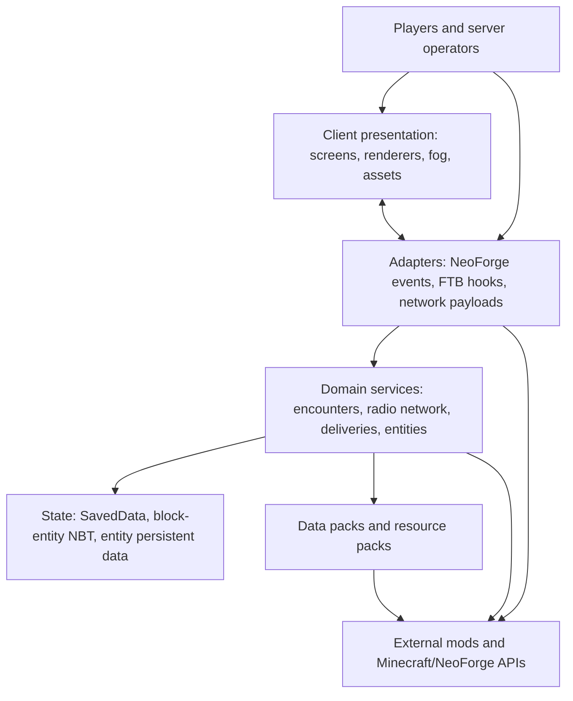
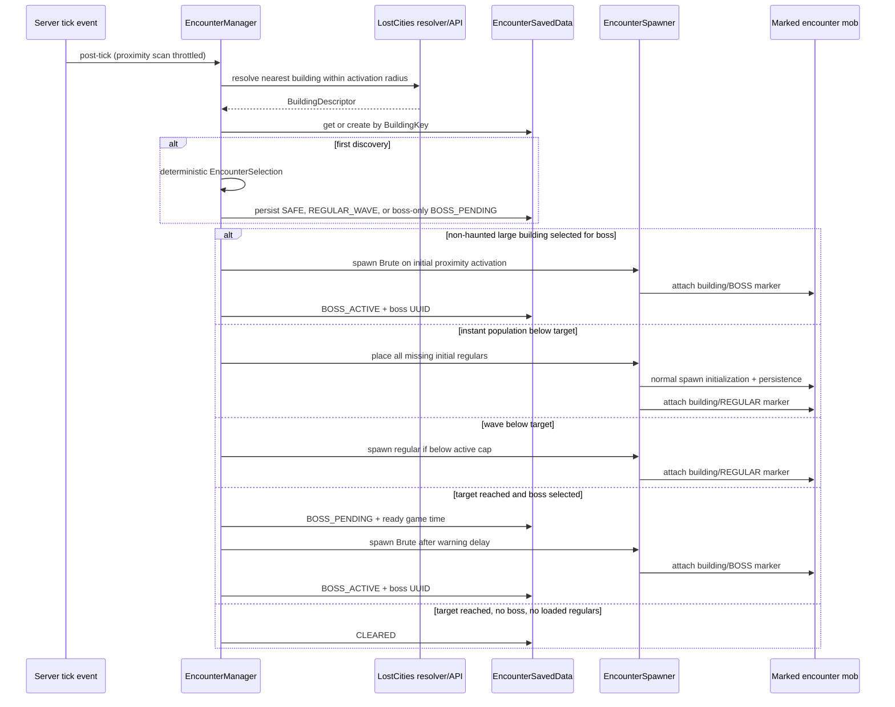
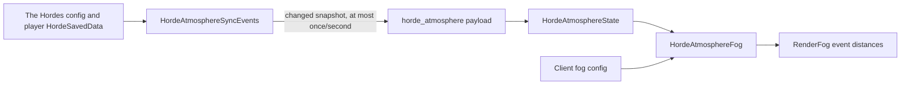
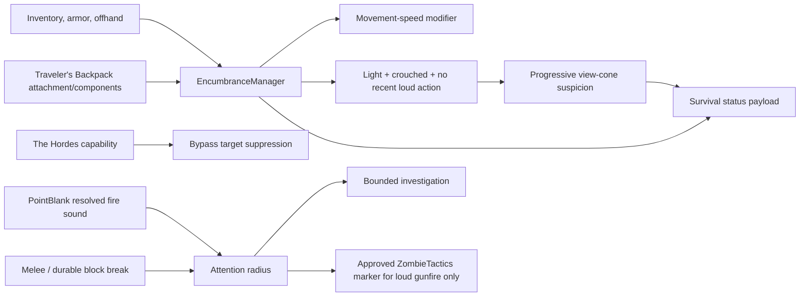

# Architecture

## 1. System purpose and boundary

Biohazard is an integration and gameplay mod for a curated Minecraft 1.21.1
NeoForge modpack. It owns the behaviors that must coordinate several other
mods, while leaving their native systems in charge of the domains they already
model well.

Biohazard owns:

- deterministic, persistent Lost Cities building encounters;
- the Brute boss, its AI, projectile, rendering, loot, and encounter role;
- radio-gated FTB Quests tasks and atomic physical submissions;
- persistent delayed courier rewards and choice delivery UI;
- the Radio Transmitter block and its calibration state;
- infection cure/suppressant items integrated with The Hordes;
- pre-horde client fog derived from The Hordes' authoritative server state;
- carried-weight tiers, movement penalties, infected stealth awareness, and
  noise-driven investigation;
- radio Horde Watch presentation derived from the same horde snapshot;
- one-time stocking of selected world-generated Handcrafted storage blocks;
- packaged quest defaults, loot, world-generation data, recipes, and in-game
  Patchouli documentation.

Biohazard deliberately does not own:

- Lost Cities terrain and building generation;
- The Hordes' event calendar, infection model, or horde spawning;
- FTB Quests' quest graph, team progress store, or quest-book UI;
- PointBlank gun mechanics;
- Waystones travel mechanics;
- Tough As Nails survival simulation;
- Handcrafted block implementation;
- Patchouli book rendering.

That boundary is the core design decision: Biohazard is the orchestration
layer, not a replacement for the modpack.

## 2. Layer model



The layers are conventions rather than separate build modules:

- **Presentation** is under `client/` plus `assets/`. It is safe to load only
  on the physical client.
- **Adapters** translate framework events or packets into domain calls. Event
  classes should remain thin.
- **Domain services** implement rules and state transitions independent of the
  event that triggered them.
- **State objects** serialize durable decisions. They should contain data and
  invariants, while orchestration remains in managers.
- **Resources** express content and integration declaratively.
- **External APIs** are explicit dependencies and compatibility boundaries.

## 3. Bootstrap and lifecycle

`Biohazard` is the composition root. NeoForge creates it because it is annotated
with `@Mod("biohazard")`. Its constructor wires the system in this order:

1. Register blocks, block entity types, items, and entity types on the mod event
   bus.
2. Attach creative-tab population, entity attributes, and network payload
   registration to the mod event bus.
3. Build and register the encounter, radio, city-operations, and survival
   server configs plus the horde-atmosphere client config.
4. Install the bundled FTB Quests defaults if the target quest directory is
   absent or empty.
5. Register FTB Quests custom task and reward callbacks.
6. Request the Lost Cities API during common setup using inter-mod
   communication.
7. Attach gameplay listeners to the NeoForge event bus: encounter ticks and
   deaths, container interactions, Handcrafted placement, horde state sync,
   delivery ticks, stealth/attention signals, encumbrance updates, and
   server-stop cleanup.

### The two event buses

Confusing the buses is a common NeoForge maintenance error.

| Bus | Used for | Biohazard examples |
|---|---|---|
| Mod event bus | Registration and lifecycle tied to mod loading | deferred registries, entity attributes, payload handlers, common/client setup |
| NeoForge event bus | Runtime game events | server ticks, living deaths, block interaction/placement, login/logout, fog rendering |

`ClientModEvents` uses an automatic client-only event-bus subscriber. During
client setup it adds fog and logout listeners to the runtime NeoForge bus.
Server classes must not directly initialize client-only Minecraft classes.

### Static lifecycle state

The following transient static families are lifecycle-sensitive:

- `EncounterManager.ticksUntilUpdate` throttles encounter scans.
- `DeliveryManager.ticksUntilUpdate` throttles courier notifications and is
  reset on server stop.
- `HordeAtmosphereSyncEvents.LAST_SENT` and `ticksUntilSync` are a transient
  packet deduplication cache and are cleared on logout/server stop.
- `EncumbranceManager`, `AwarenessManager`, `AttentionManager`, and
  `SurvivalStatusSync` keep only recalculation caches, suspicion/alert timers,
  short-lived investigation targets, and packet deduplication state. All are
  cleared on logout or server stop as appropriate.

Static state must never become the only copy of gameplay progress. The durable
copies are described below.

## 4. Server/client authority

Minecraft may run a logical server and logical client in one process, but they
remain separate authority domains.

| Concern | Authority | Client role |
|---|---|---|
| Encounter selection and phase | Server | Receives normal entity/world updates and messages |
| Encounter spawns and death credit | Server | Renders entities |
| Radio calibration | Server block entity | Renders block; interaction response is server-driven |
| Quest accept/turn-in | Server FTB callback | Displays FTB book/button |
| City status snapshot | Server city-zone service | Renders the radio-linked compact drawer in the FTB Quests screen |
| Courier contents, timer, mailbox | Server `SavedData` | Shows messages and choice screen |
| Courier choice | Server validates delivery, ownership, readiness, index, and radio range | Sends requested index |
| Infection medicine | Server | Plays ordinary item/effect presentation |
| Horde schedule | The Hordes on server | Receives compact atmospheric snapshot |
| Weight, quiet state, suspicion, attention radii | Server survival services | Renders the latest compact HUD snapshot |
| Radio horde-day/active state | The Hordes on server | Renders existing horde snapshot only during a radio quest session |
| Fog distance | Client config and renderer | Computes and applies presentation only |

The courier choice path is the clearest security example. The client receives a
delivery UUID and display item IDs, then sends a selected index. The server does
not trust the screen: it rechecks the UUID, owner, readiness, delivery kind,
index bounds, and proximity to a calibrated transmitter before mutating state.

## 5. State ownership and persistence

### 5.1 Encounter world state

`EncounterSavedData` is stored in the Overworld data storage under
`biohazard_building_encounters`. Using the Overworld store provides one
server-wide map even though keys include their dimension.

The map key is `BuildingKey`:

```text
dimension resource id + root chunk X + root chunk Z
```

The value is `BuildingEncounter`:

```text
building id
boss-selected decision
target kill count
spawn mode (`INSTANT` or `WAVE`)
current phase
regular death count
successful initial regular spawn count
whether initial population was attempted
boss UUID, if activated
boss-ready game time
```

Selection is materialized once per physical building. The world seed, dimension
and root chunk coordinate make the initial roll deterministic, but the result
is also persisted. Changing encounter chances or kill ranges affects only
buildings that have not yet been materialized.

Malformed individual saved entries are skipped so one damaged record does not
invalidate all encounter data. `BuildingEncounter` writes version `2`.
Version-1 records have no spawn-mode fields and load as `WAVE`, preserving
their original behavior.

### 5.2 Encounter entity markers

Spawned encounter mobs receive an entity persistent-data compound named
`biohazardEncounter`. It contains the serialized building key and a role of
`regular` or `boss`. This marker:

- lets loaded-entity queries count only mobs belonging to this building;
- lets the death event credit the correct encounter;
- survives entity serialization and chunk unload/reload.

It is not a replacement for `EncounterSavedData`. Entity markers answer "which
encounter does this mob belong to?" while saved data answers "what is the
building's durable phase and progress?"

### 5.3 Courier world state

`DeliverySavedData` is stored in the Overworld data storage under
`biohazard_radio_deliveries`. It contains a server-wide list of per-player
`RadioDelivery` records. Each record persists:

- unique delivery UUID;
- owner UUID;
- originating FTB reward id;
- manifest name and category;
- order and ready game times;
- delivery kind (`ITEMS` or `CHOICE`);
- the already-rolled `ItemStack` list;
- whether the ready notification was sent.

The manifest is rolled at reward claim time. Persisting the resulting stacks is
intentional: restarting the server or editing a loot table cannot reroll an
earned shipment. Timers use Overworld game time, so real time while the server
is stopped does not advance deliveries.

Malformed individual deliveries are logged and skipped. Empty deliveries are
also not reloaded. Changes to item IDs, components, NBT keys, or delivery kinds
therefore need save-compatibility consideration.

### 5.4 Radio block state

Each Radio Transmitter owns a `RadioTransmitterBlockEntity`. It persists its
`ready_at` game-time value, whether its city survey completed, and its optional
`CityZoneKey`. Placement or first load without state starts calibration at
`current game time + configured calibration ticks` and starts a paced city
survey. The radio connects only when both are complete. Moving the block
creates a new block entity and therefore recalibrates and surveys again.

### 5.5 City-zone world state

`CityZoneSavedData` is stored server-wide under `biohazard_city_zones`. It
persists connected Lost Cities footprints (or stable capped fallback sectors),
unique cleared `BuildingKey` sets, FTB city-operation bindings, and clears that
occurred before a radio mapped their city.

When a survey registers, existing `CLEARED` records in
`EncounterSavedData` are imported as a save-compatible migration path. This
lets pre-city-operation worlds retain legitimate encounter progress.

Danger derives from the cleared-key set rather than a mutable counter. The
default progression is one level per five clears up to level 12. An entity's
highest applied danger is also stored in its persistent data, while a named
permanent maximum-health modifier makes the upgrade survive unloading and
prevents leaving a city from weakening it.

### 5.6 Brute and normal entity state

The Brute relies on ordinary Minecraft entity persistence for health, target,
position, and the encounter marker. Its boss-bar participant sets and tracking
sets are in-memory presentation state; they are rebuilt from interaction and
tracking and cleared on death/removal.

### 5.7 Transient client state

`HordeAtmosphereState` contains only the most recent payload snapshot. It is
reset when the client logs out and is never saved. The Hordes remains the
durable and authoritative source.

`CityStatusClient` likewise holds only the latest radio status snapshot. It is
shown only while the FTB Quests screen is open, starts collapsed as a compact
right-edge drawer, and is cleared when that screen closes. City progress itself
remains server-authoritative in `CityZoneSavedData`.

`SurvivalStatusClient` holds only the latest server HUD snapshot, including
the server's tier thresholds and movement penalties used by the inventory
indicator tooltip.
`AwarenessManager` suspicion and alert memory, `AttentionManager`
investigations, and `EncumbranceManager` weight snapshots are intentionally
transient and are recalculated from loaded entities, inventory, and external
mod state. No new world-persistent format is introduced.

## 6. Runtime flows

### 6.1 Encounter discovery and progression



Detailed rules:

1. Every activation-scan interval, each living non-spectator player resolves
   the nearest physical building within the configured radius. Selecting only
   the nearest avoids mass activation in dense cities. Multi-building chunks
   normalize to their root so players near different member chunks share one
   encounter.
2. Excluded building IDs are ignored before materialization. If a building was
   already persisted, its persisted ID is used for the exclusion check.
3. First materialization deterministically chooses safe/haunted, optional boss,
   and inclusive kill target, and snapshots the configured spawn mode. The
   large-building boss chance applies independently of the haunted roll when
   the footprint spans multiple chunks. A selected non-haunted large building
   starts directly in `BOSS_PENDING`; a 1x1 building can select a boss only
   when haunted.
4. `INSTANT` attempts the entire target population once, persists successful
   spawn progress, retries only missing placements, and never replaces a
   successfully spawned member. These mobs require persistence.
5. `WAVE` maintains at most `maxActiveRegularMobs` loaded marked mobs and
   replaces them until the kill target.
6. Near-player spawn search uses the configured distance annulus. Proximity
   activation and instant population can instead sample interior floor bands,
   rotating the initial population across them. The roof band is excluded and
   every candidate requires an interior ceiling, plus minimum player distance,
   loaded area, world border, solid support, empty fluid, collision-free
   bounds, and obstruction rules.
7. A regular death increments progress only when the dead entity carries the
   correct marker.
8. At the target, infected boss buildings enter `BOSS_PENDING` immediately
   even if surviving regular mobs remain. Non-boss buildings wait for all
   loaded marked regulars to be gone before clearing.
9. An infected pending boss is spawned after the warning time. A boss-only
   non-haunted building instead attempts its Brute immediately on first
   proximity activation. If a correctly marked Brute already exists, it is
   adopted. A missing boss during `BOSS_ACTIVE` is treated as unloaded, not as
   permission to duplicate it.
10. A marked boss death uses the same centralized finished transition as a
   regular encounter. It clears the building even if a marked regular remains,
   then offers that unique building key to its mapped city zone. Cleared and
   safe states are terminal.

Container locking is interaction-driven rather than a separate tick:

- only `RandomizableContainerBlockEntity` instances are considered;
- player and container must both be inside the same resolved building;
- excluded buildings are ignored;
- interaction materializes an undiscovered encounter if necessary;
- `REGULAR_WAVE`, `BOSS_PENDING`, and `BOSS_ACTIVE` cancel the interaction;
- `SAFE` and `CLEARED` allow it.

### 6.2 City survey, progression, and infected scaling

During calibration, each loaded radio inspects a bounded number of candidate
chunks per tick. Cardinally connected city chunks form the persisted exact
footprint by default. A configurable hard cap switches extremely large city
profiles to a stable sector key.

When the centralized encounter-finished transition records a new building:

1. the matching zone adds its `BuildingKey` once;
2. danger is recomputed from the unique cleared count;
3. a level increase reapplies the highest applicable danger to loaded tagged
   infected in the footprint plus its influence perimeter;
4. unloaded infected receive the same check through the entity-load event;
5. the stored entity danger is never reduced when it leaves the zone.

Overlapping influence uses the highest level. The
`biohazard:city_scaled_infected` entity-type tag includes the Brute and is the
data-pack extension point for other infected.

### 6.3 Radio quest acceptance and atomic turn-in

```mermaid
sequenceDiagram
    participant Player
    participant FTB as FTB Quests custom task
    participant FI as FTBQuestsIntegration
    participant RN as RadioNetwork
    participant RS as RadioSubmission
    participant Inv as Player inventory/team progress

    Player->>FTB: press Accept or Transmit
    FTB->>FI: CustomTaskEvent callback
    FI->>RN: find calibrated transmitter in range
    alt no connected transmitter
        FI-->>Player: out-of-range message
    else accept task
        FI->>FTB: set accept progress complete
    else completion task
        FI->>RS: validate quest and submissions
        RS->>FTB: verify every required non-optional objective
        RS->>Inv: plan all tagged item allocations
        alt anything missing
            RS-->>Player: failure; consume nothing
        else all available
            RS->>Inv: shrink planned slots and add task progress
            RS->>FTB: complete final custom task
        end
    end
```

The radio proximity scan examines a configured cube around the player, applies
a spherical distance limit, skips unloaded positions, checks the registered
block, then asks its block entity whether calibration has completed.

Atomic item submission uses a two-phase algorithm. It first models remaining
counts per inventory slot and allocates all tagged `ItemTask` requirements
without mutation. Only if every requirement can be satisfied does it shrink
real stacks and update FTB team progress. This prevents partial loss on a
failed turn-in.

### 6.4 Reward claim, courier wait, and collection

1. FTB Quests fires `CustomRewardEvent` for a tagged custom reward.
2. `FTBQuestsIntegration` extracts the manifest suffix, category, delivery kind,
   and optional choice count.
3. `DeliveryManager` rolls `biohazard:quest_delivery/<manifest>` using a chest
   loot context at the player, including player luck.
4. Standard deliveries save all generated stacks. Choice deliveries reroll the
   manifest up to `optionCount * 8` times to collect distinct item/component
   combinations.
5. The delivery is persisted with a ready time calculated from its category.
6. Once per second, the manager marks ready online-player deliveries as
   notified and sends a message. Offline owners are notified after they are
   online and a later update runs.
7. Interacting with a calibrated transmitter first inserts all ready standard
   deliveries. Remainders that do not fit stay persisted.
8. If a ready choice exists, the server sends its UUID and item IDs to the
   client and stops before opening the quest book.
9. The choice screen sends the selected index. The server validates all
   conditions, converts the delivery to a one-stack standard delivery, then
   runs normal collection.
10. If no choice screen opens, the transmitter reports mailbox status and
    opens the standard FTB quest book.

### 6.5 Horde atmosphere synchronization



The server snapshot contains only `hordeDay`, `active`, `dayLength`, and
`hordeStartTime`. In non-Overworld dimensions or when The Hordes event is
disabled, both booleans are false. Command-only mode treats only an active
event as a horde day.

The client computes a smoothstep fade from `start - fadeDuration` to the event
start. Active events use full strength immediately. It only moves fog planes
closer; it never expands fog distance imposed by Minecraft, another mod, or the
environment. The handler applies only to terrain fog with no fluid fog in the
Overworld.

### 6.6 Handcrafted storage stocking

Selected Handcrafted containers do not carry vanilla loot-table metadata, so
Biohazard fills them lazily on first server-side interaction:

1. A player-placed selected storage block is marked
   `biohazard_handcrafted_storage_player_placed` on its block entity.
2. On right-click, selected storage IDs are intercepted before encounter
   container locking.
3. Player-placed or already-stocked containers are left unchanged.
4. Other selected containers are filled from
   `biohazard:chests/handcrafted_storage`, the vanilla loot criterion is
   triggered, and the block entity is marked
   `biohazard_handcrafted_storage_stocked`.
5. The event is then considered handled by this service; encounter locking does
   not apply to these Handcrafted containers.

This ordering is deliberate and should be revisited explicitly if handcrafted
storage is ever intended to respect haunted-building locks.

### 6.7 Infection medicine

Both medicines subclass `PotionItem`, so Minecraft owns consumption animation,
stack use, and the returned bottle behavior.

- **Infection Cure** refuses use when the player is not currently infected.
  On successful server consumption it calls The Hordes infection capability's
  native progression bookkeeping, removes the infected effect, sends The
  Hordes' cure tracking message, and displays status.
- **Antiviral Suppressant** preserves the current infection amplifier and
  presentation flags, adds five minutes to the current stage up to ten minutes
  remaining, and grants five minutes of The Hordes immunity. If not currently
  infected, it still grants immunity.

Direct imports from The Hordes and Atlas Lib make this a compile-time
compatibility hotspot even though those artifacts are not published
transitively by Biohazard.

### 6.8 Encumbrance, stealth, and attention



The server recalculates weight and owns the movement modifier. A quiet player
is protected only from automatic target promotion; line of sight inside an
infected's view cone accumulates suspicion, and close sight detects
immediately. Existing targets receive configured memory. Horde-spawned mobs
bypass this filter and remain controlled by The Hordes' native tracking goal.

PointBlank shots are recognized from the resolved server sound and active
attachment set. Suppressed fire uses a 12-block direct investigation and never
creates a global marker. Unsuppressed fire defaults to 96 blocks and creates
the only Biohazard-approved ZombieTactics marker. Melee and durable block
breaks use their own bounded ranges. Biohazard skips marker creation when
ZombieTactics' configured marker range would exceed the current event radius.

## 7. External dependency map

### 7.1 Required runtime mods

| Dependency | Metadata relationship | Java relationship | Resource relationship | Biohazard feature |
|---|---|---|---|---|
| Minecraft 1.21.1 | required | foundational API | all standard resources | entire mod |
| NeoForge 21.1.235+ | required | loader, events, config, networking, registries, `SavedData` | generated mod metadata | entire mod |
| Lost Cities 1.21-8.3.10+ | required, load after | compiled API + IMC | `lostcities`, `lcmt`, and `biohazard` Lost Cities JSON | building resolution, encounters, furnished generation |
| Handcrafted 4.0.3 to <4.1 | required, load after | registry lookup by string only | palette block IDs and selected storage IDs | generated furniture and storage loot |
| Patchouli 1.21.1-93+ | required, load after | no direct Java API | `assets/biohazard/patchouli_books` and a starter book stack | Survivor's Field Manual |
| PointBlank 2.2.0+ | required, load after | direct gun, sound-feature, and attachment API | recipes, quest icons/objectives, loot, manual | firearms progression and shot attention |
| Tough As Nails 10.1.0.13+ | required, load after | no direct Java API | starter loot, delivery loot, manual | survival progression |
| The Hordes 1.6.3c to <1.7 | required, load after | direct config, saved-data, capability, effect, packet imports | manual and loot context | horde fog and infection medicine |
| Waystones 21.1.36+ | required, load after | no direct Java API | recipe overrides, advancement overrides, loot, manual | travel progression |
| FTB Quests 2101.1.27 to <2102 | required, load after | direct tasks, rewards, events, open-book message | bundled SNBT, theme/lang assets | Survivor Network and courier |

### 7.2 Optional and incompatible mods

| Dependency | Relationship | Effect |
|---|---|---|
| Lost Cities Modern Tweaks 2.0.7 to <2.1 | optional, load after | Biohazard supplies targeted `lcmt:` overrides and decorated copies of tower floor parts. Without it, those resources are simply unused. |
| Traveler's Backpack 10.1.36 to <10.2 | optional, load after | Equipped and stored backpack contents, tools, upgrades, and fluids contribute to weight. The integration class is loaded only when present. |
| ZombieTactics 1.3.3 to <1.4 | optional, load after | Automatic marker joins can be replaced; Biohazard emits an approved marker for unsuppressed fire only. |
| Lost Souls | incompatible, any version | Both mods manage Lost Cities building encounters, so metadata prevents a conflicting installation. |

### 7.3 Runtime libraries supplied by dependencies

The development runtime pins Resourceful Lib, GeckoLib, GML, GlitchCore, Atlas
Lib, and Balm because required mods need them. They are `localRuntime`, not
Biohazard API dependencies. Atlas Lib is additionally `compileOnly` because The
Hordes' cure packet type implements its networking interface.

### 7.4 Gradle dependency scopes

| Scope | Meaning here |
|---|---|
| `implementation` | Biohazard compiles directly against the API and exposes the dependency on its compile/runtime classpath: Lost Cities and FTB Quests. |
| `compileOnly` | Needed to compile direct imports but expected from the modpack at runtime: The Hordes, Atlas Lib, PointBlank, and Traveler's Backpack. |
| `localRuntime` | Present in development/tests without becoming a transitive published dependency. |
| `testImplementation` | JUnit Jupiter test API and engine support. |

The generated NeoForge metadata is the actual player-facing installation
contract. Gradle scopes alone do not make a mod required at launch.

## 8. Failure containment and defensive behavior

The project already uses several useful failure-containment patterns:

- Lost Cities resolution returns `Optional.empty()` until the API is available
  or when a chunk is not a real building.
- Invalid configured encounter mob IDs are ignored and warned once.
- Spawn search is bounded by a configurable attempt count.
- Malformed individual encounter/delivery records do not discard the entire
  saved-data file.
- Empty/invalid courier manifests log an error and do not schedule an empty
  package.
- Atomic radio submission does not mutate inventory before all requirements
  are allocated.
- Client choice requests are fully revalidated server-side.
- Quest defaults preserve any non-empty existing quest directory.

Important remaining maintenance risks are cataloged in
[Development and maintenance](development-and-maintenance.md#known-risk-areas-and-design-debt).

## 9. Extension points

Prefer the smallest owning layer when adding behavior:

- Add encounter rules to the encounter domain, with events only adapting input.
- Add a new registry object through the appropriate `Mod*` deferred register.
- Add a new client presentation behind a client-only event or payload handler.
- Add a courier category in the enum, config, serialization, authoring docs,
  and tests together.
- Add a new quest contract through SNBT tags and a loot-table manifest; Java
  should change only if the protocol changes.
- Add ordinary loot, recipes, advancements, Patchouli pages, or Lost Cities
  content as resources.
- Add external-mod integration behind a small adapter package so API churn does
  not spread through the domain.
